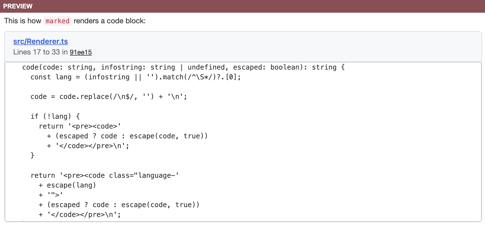
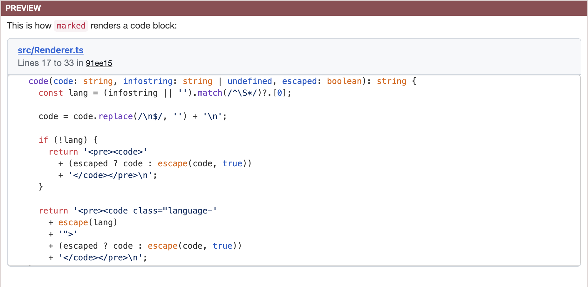

# marked-gh-permalink
This extension allows you to use GitHub permalink to code snippet in your
markdown file, and it'll render just like how GitHub rendenrs code snippet from
its repository, as long as
1. You provide a GitHub access token.
2. The token has access right to the repository your permalink points to.

# Usage
Here we'll walk through how to try out this extension from scratch, this assumes
you have the following:
- installed `node` and `npm`
- have a GitHub access token ready (since rendering the permalink requires
  fetching from GitHub API)

First we create a new directory, initialize `npm` and download `marked` and this
extension (for `npm init` just hit defaults for everything it asks):
```bash
mkdir test
npm init -y
npm install marked marked-gh-permalink
```

Then we create a test file `index.mjs` with the following content:
```javascript
import { marked } from 'marked';
import markedGhPermalink from 'marked-gh-permalink';

// Set up marked
const ghToken = process.env.GH_PERMALINK_API_TOKEN
marked.setOptions(marked.getDefaults());
marked.use(markedGhPermalink(ghToken));

// Example markdown text with permalink to GitHub code snippet
const input = `
This is how \`marked\` renders a code block:
https://github.com/markedjs/marked/blob/91ee15b2d43da92f751165c88d1a78ebc3b99114/src/Renderer.ts#L17-L33
`

// Convert to html and print it out.
const result = await marked(input);
console.log(result);
```

Finally we run it with our github token:
```bash
GH_PERMALINK_API_TOKEN=<fill-in-your-token> node index.mjs
```

Finally, you'll see the HTML printed in your terminal. If you copy and paste
that to [html code editer](https://htmlcodeeditor.com/), you'll see this:


Note that it doesn't have syntax highlighting, that's because we use
[highlight.js](https://highlightjs.org/) for that and it requires importing CSS
separately. So if we add the following line to the beginning of the HTML we had:

```html
<link rel="stylesheet" href="https://cdnjs.cloudflare.com/ajax/libs/highlight.js/11.9.0/styles/github.min.css">
```

We get the github-style syntax highlighting, as shown below:

